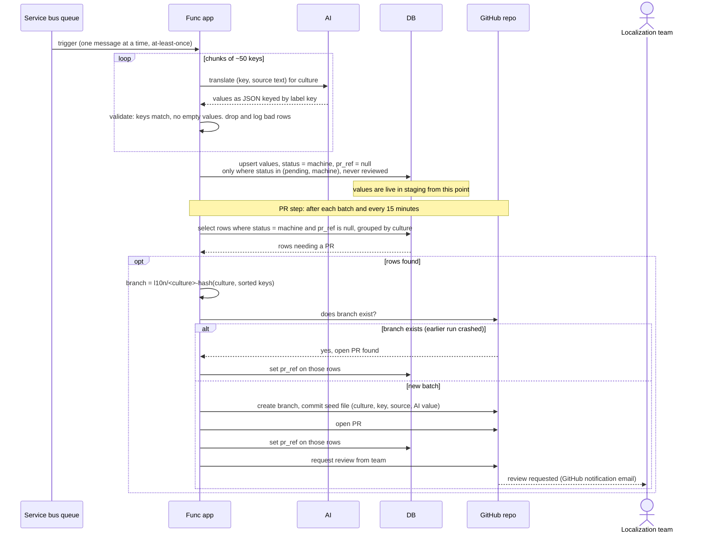

# Translating and opening the PR

Picks up where [request missing translations](request-missing-translations.md)
left a message on the queue. Identical for both paths. Two steps in one Func
app: translate, then open a PR.

Translate:

- One message at a time. Delivery is at least once.
- AI call chunked at about 50 keys per request. The reply is validated:
  every returned key was requested, every requested key is present, no value
  is empty. Bad rows are dropped and logged, the rest are saved.
- The upsert writes only rows whose status is pending or machine. A reviewed
  row is never overwritten. Values are live in staging from this write.

PR step, after each batch and on a 15 minute timer:

- Selects rows with status machine and no PR reference, grouped by culture.
- Branch name is a hash of the culture plus the sorted keys, so the same rows
  always map to the same branch. If the branch exists, an earlier run
  crashed: write the PR reference and stop. Otherwise create the branch,
  commit the seed file, open the PR, write the PR reference, then request
  reviewers.
- Idempotent on both sides: the PR reference column on the DB side, the
  deterministic branch name on the GitHub side. It never re-runs AI.

