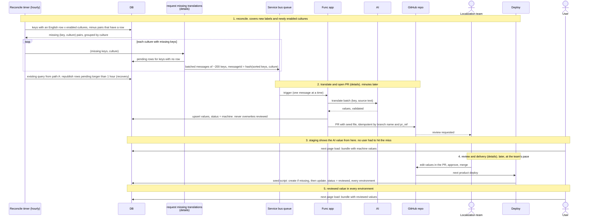

# Path B: reconcile timer

**Backlog. Not in the current build.** The catch-up path. An hourly timer in the Func app finds every (key,
culture) pair that should exist and does not: every key with an English
row, crossed with every enabled culture, minus pairs that already have a
row. Whatever is left is requested, once per culture. This covers a
developer adding a label, a culture being enabled, and anything else no user
has hit yet. No hook into the insert path.

Latency is up to an hour, which is fine: [path A](path-user-landed-on-a-page.md)
fires immediately for anyone who opens the page sooner. From the queue
onward the two paths are identical.

Runs in staging only. Other environments receive reviewed values through the
seed script on deploy. The DB is the source of truth.

The three shared stages are drawn as boxes here and opened up in `details/`:

- [request missing translations](details/request-missing-translations.md):
  dedup, pending rows, chunked publish, stale-pending recovery. Path A's
  hourly recovery timer is the timer this query is added to.
- [translate and open PR](details/translate-and-open-pr.md): AI call with
  validation, guarded upsert, idempotent PR step.
- [review and delivery](details/review-and-delivery.md): merge, seed script
  on deploy, reviewed value in every environment.

