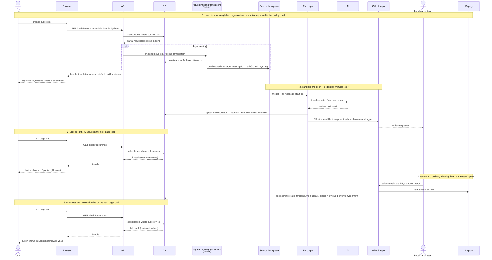

# Path A: a user landed on a page

The priority path. A user opens a page in a culture that has no value for
some label. The page renders at once with the default text, the miss is
requested in the background, AI fills it within minutes, and the localization
team reviews it later through a pull request. Nothing on this path waits for
anyone.

Runs in staging only. Other environments receive reviewed values through the
seed script on deploy. The DB is the source of truth: the moment a value
lands there, it is live in that environment.

The three shared stages are drawn as boxes here and opened up in `details/`:

- [request missing translations](details/request-missing-translations.md):
  dedup, pending rows, chunked publish, stale-pending recovery.
- [translate and open PR](details/translate-and-open-pr.md): AI call with
  validation, guarded upsert, idempotent PR step.
- [review and delivery](details/review-and-delivery.md): merge, seed script
  on deploy, reviewed value in every environment.

