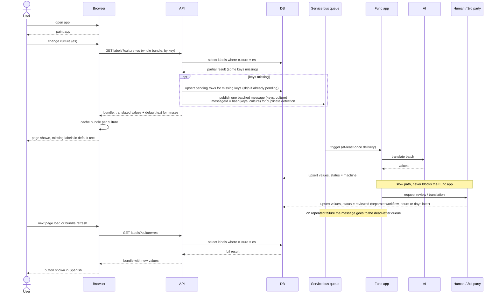

# Label localization sequence

On-demand, asynchronous translation of UI labels. The browser fetches the whole
label bundle for a culture through the API and caches it. Misses fall back to
the default text, get marked pending once, and are published as one batched
Service Bus message. A Func app fills fast translations with AI; slow human or
third-party translations write back through a separate workflow. The browser
picks up new values on its next bundle fetch. No polling.

Design rules baked in:

- Labels are keyed by identifier, never by English text.
- One consumer, so a queue, not a topic. The Func app is triggered by the queue directly.
- A pending row plus Service Bus duplicate detection (message ID = hash of key + culture) stops repeat requests.
- Stores are upserts, since delivery is at least once. Dead-letter queue with a retry limit for bad messages.
- Every translation carries a status: pending, machine, reviewed.
- The browser never talks to the DB.

