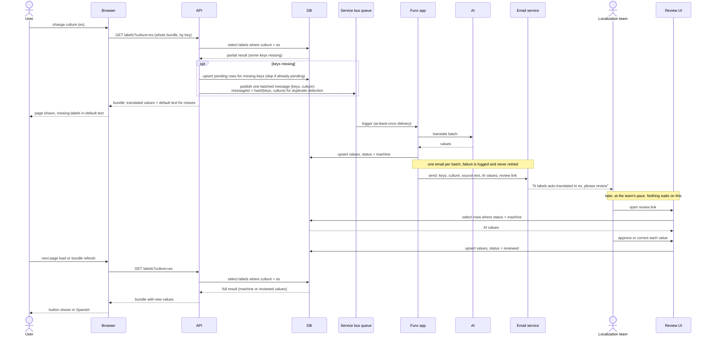

# Label localization sequence, v2: review notification

Same flow as v1, plus a notification step. When the Func app fills a missing
label with an AI translation, it emails the localization team (a group address
or distribution list) with the batch: key, culture, source text, AI value, and
a review link. The AI value goes live immediately with status `machine`. A
reviewer later corrects or approves it through the review UI, which sets
status `reviewed`.

What changed from v1:

- The human path is no longer a request from the Func app. It is a notification
  plus a self-service review. The team reviews when they have time; nothing
  waits on them.
- One email per batch, not per label. If batches are frequent, switch to a
  daily digest built from rows with status `machine`.
- Email failure is logged and swallowed. It must never fail the queue message,
  or at-least-once redelivery would re-run the AI translation and re-charge you.
- Still a single queue and a single consumer. The email is sent by the Func app
  after the upsert, so it needs nothing new on the bus.

