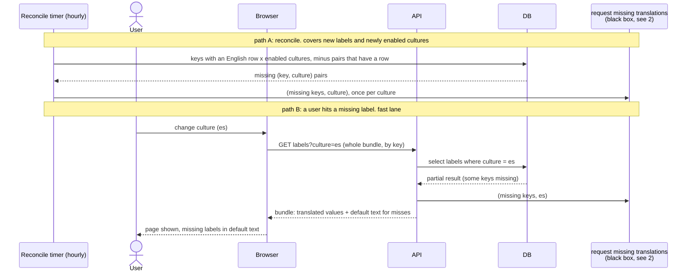

# 1. Requesting translations

Two callers ask for translations. Both end in the same function, "request
missing translations", drawn here as a black box and explained in
[2-request-missing-translations.md](2-request-missing-translations.md).

- **Reconcile timer, hourly.** One query finds every (key, culture) pair
  that should exist and does not: every key with an English row, crossed with
  every enabled culture, minus pairs that already have a row. Whatever is
  left is requested. This covers a developer adding a label, a culture being
  enabled, and anything else that slipped through, with no hook into the
  insert path.
- **A user hits a missing label.** The page renders with default text and
  the miss is requested in the background. This is the fast lane: it fires
  immediately, while the timer catches up within the hour.

All of this runs in staging only.

