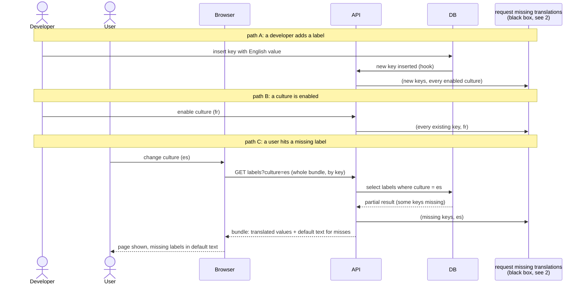

# 1. Requesting translations

Three events can ask for a translation. All three end in the same function,
"request missing translations", drawn here as a black box and explained in
[2-request-missing-translations.md](2-request-missing-translations.md).

- A developer inserts a new label with its English value. The hook asks for
  every enabled culture, so the label is translated before anyone opens the
  page.
- A culture is enabled. The hook asks for every existing key.
- A user opens a page and a label is missing for their culture. The page
  renders with default text, and the miss is requested in the background.
  This is the safety net for anything the first two paths missed.

All of this runs in staging only.

