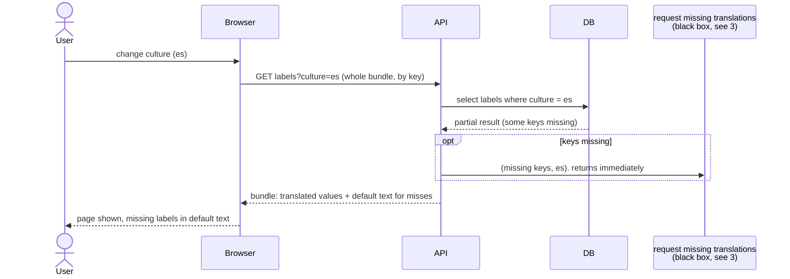

# 1. A user hits a missing label

The priority scenario. A user opens a page in a culture that has no value
for some label. The page must render immediately with the default text, and
the miss is requested in the background through "request missing
translations", drawn here as a black box and explained in
[3-request-missing-translations.md](3-request-missing-translations.md).

Nothing on this path waits for a translation. The user sees the AI value on
their next page load, once part 4 has run.

Runs in staging only.

