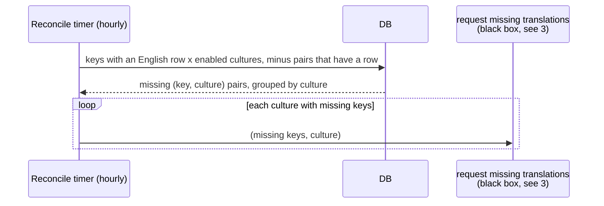

# 2. Reconcile timer

The second caller of "request missing translations" (see
[3-request-missing-translations.md](3-request-missing-translations.md)).
Lower priority than part 1: it catches what no user has hit yet.

An hourly timer in the Func app runs one query: every key with an English
row, crossed with every enabled culture, minus pairs that already have a
row. Whatever is left is requested, once per culture. This covers a
developer adding a label, a culture being enabled, and anything else that
slipped through, with no hook into the insert path.

The same timer runs a second query that republishes rows pending longer
than an hour. That half is drawn in part 3, since it belongs to recovery.

Runs in staging only.

