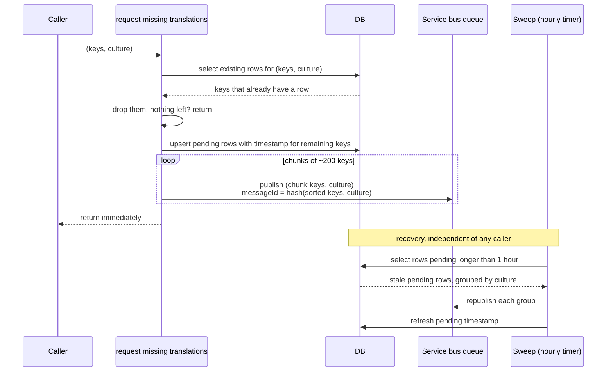

# 2. Inside "request missing translations"

One function, three callers (see [1-requesting-translations.md](1-requesting-translations.md)).
Input: a set of keys and one culture. It never calls AI and never waits.

Rules:

- Skip any key that already has a row for that culture, whatever its status.
  Pending, machine, and reviewed rows are all "already handled".
- Upsert pending rows first, publish second. A crash in between leaves a
  pending row that the sweep recovers, never a message with no row.
- Chunk at a couple hundred keys per message. Message ID is a hash of the
  chunk's sorted keys plus the culture, so Service Bus duplicate detection
  drops a repeat inside the window.
- An hourly sweep republishes rows pending longer than an hour and refreshes
  their timestamp, so a dead-lettered batch does not leave keys stuck.
- Runs only in staging, behind an explicit flag.

