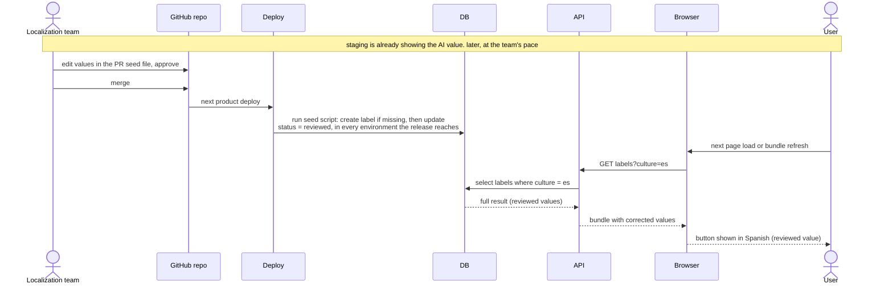

# 4. Review and delivery

Picks up where [3](3-translate-and-open-pr.md) opened a PR. Nothing here
waits on anyone, and the Func app is not involved.

- Staging already shows the AI value. The PR is the review surface: the
  reviewer edits values in the seed file, approves, and merges.
- The next product deploy runs the seed script in every environment the
  release reaches. The script creates any label that is missing, then updates
  it, and sets status reviewed. It is idempotent, last write wins across
  files, and a no-op when there are no new files.
- Reviewed rows are never touched by the AI path again.

