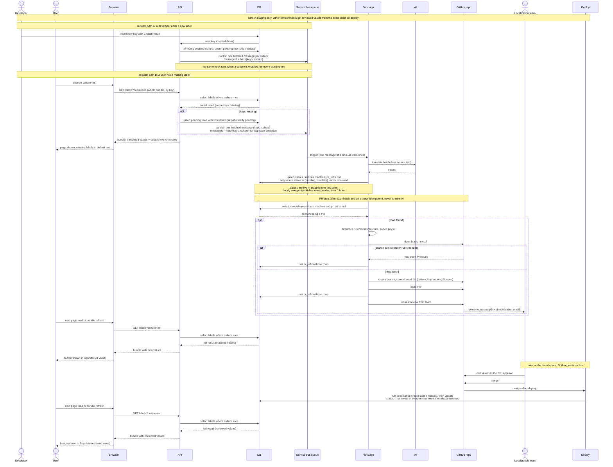

# Label localization sequence, v3: pull request review, DB source of truth

Scope: product UI strings only. Tenant-authored content is out of scope.

The DB is the source of truth for culture, key, and value. The moment a value
lands in the DB it is live in that environment. The pull request replaces the
Review UI and the email: it is the notification, the review tool, and the
audit log.

This process runs in staging only. Staging is where misses are detected, AI
values are written, and PRs are opened. Other environments receive reviewed
values through the seed script on deploy.

Flow:

1. A miss in the bundle upserts pending rows and publishes one batched message
   per culture. The same "request missing translations" function also runs
   when a developer inserts a new English label (for every enabled culture)
   and when a culture is enabled (for every existing key), so new labels are
   translated before any user opens the page.
2. The Func app asks AI to translate the batch and upserts the values into the
   DB with status `machine` and no PR reference. Staging shows them on the next
   bundle fetch.
3. A separate PR step selects rows with status `machine` and no PR reference,
   grouped by culture. The branch name is a hash of the culture plus the
   sorted keys, so the same rows always map to the same branch. If that
   branch already exists, the step writes its PR reference on the rows and
   stops. Otherwise it commits a seed file (culture, key, source text, AI
   value), opens a pull request, writes the PR reference, then requests the
   team as reviewers. It runs after each batch and on a timer, so a failed PR
   is picked up on the next run without re-running AI.
4. A reviewer edits the values in the PR, approves, and merges. The next
   product deploy runs the seed script, which creates any label that is
   missing and then updates it, setting status `reviewed`. That applies in
   every environment the release reaches.
5. The Func app never merges and never deploys.

Rules that keep it safe:

- The AI upsert only writes rows whose status is `pending` or `machine`. A
  `reviewed` row is never overwritten by a later AI run.
- The seed script always wins. It creates missing labels, updates existing
  ones, and sets status `reviewed`, which the AI path will not touch again.
- The PR step is idempotent twice over. The DB side is the PR reference
  column. The GitHub side is the deterministic branch name: a re-run after a
  crash finds the existing branch instead of opening a second PR.
- Pending rows carry a timestamp. An hourly sweep republishes rows pending
  longer than an hour, so a dead-lettered batch does not leave keys stuck.
- Queue consumer handles one message at a time. A rejected push is retried
  once after a fresh read of main.
- The request-missing-translations function runs only in staging, behind an
  explicit flag. Large requests, such as enabling a culture with thousands of
  keys, are chunked at a couple hundred keys per message.

Accepted for now: one PR per batch, and reviewers editing the seed file by
hand.

