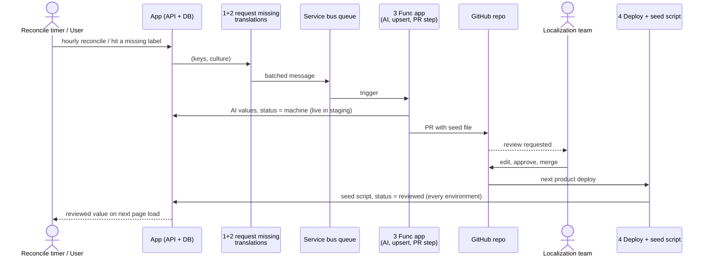

# Label localization sequence, v3: pull request review, DB source of truth

Scope: product UI strings only. Tenant-authored content is out of scope.
Runs in staging only. Other environments receive reviewed values through the
seed script on deploy.

The DB is the source of truth for culture, key, and value. The moment a value
lands in the DB it is live in that environment. The pull request replaces a
Review UI and an email: it is the notification, the review tool, and the
audit log. The Func app never merges and never deploys.

The flow is drawn in four parts, each in its own file. This page is the
overview, with each part collapsed to one box.

1. [Requesting translations](1-requesting-translations.md): the two callers
   that ask for a translation. An hourly reconcile timer that finds every
   missing (key, culture) pair, and a user hitting a missing label.
2. [Inside "request missing translations"](2-request-missing-translations.md):
   the shared function both call. Dedup, pending rows, chunked publish, and
   the stale-pending recovery on the same timer.
3. [Translating and opening the PR](3-translate-and-open-pr.md): queue to AI
   to DB, then the idempotent PR step.
4. [Review and delivery](4-review-and-delivery.md): reviewer merges, seed
   script runs on deploy, every environment gets the reviewed value.

Feasibility: [feasibility.md](feasibility.md).

