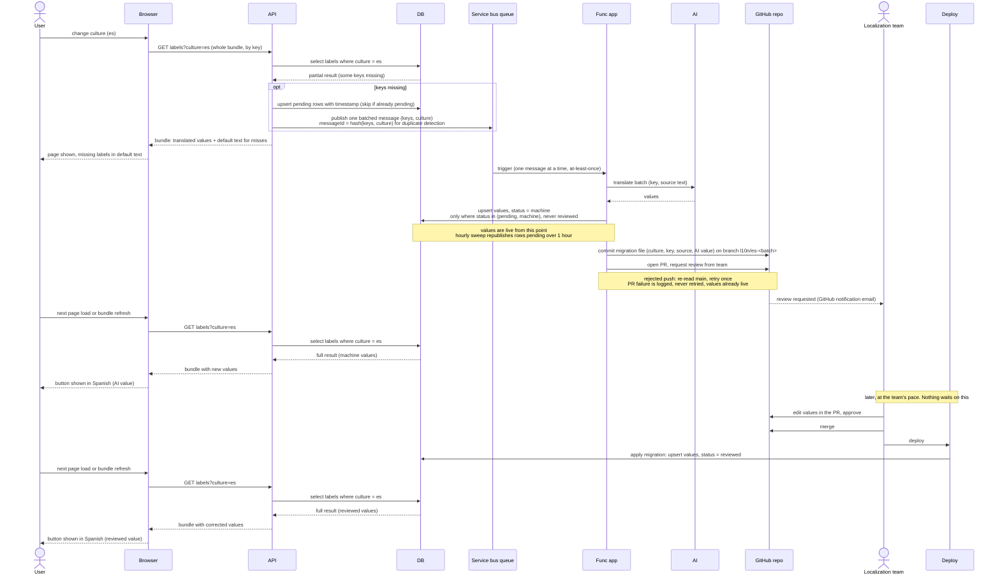

# Label localization sequence, v3: pull request review, DB source of truth

Scope: product UI strings only. Tenant-authored content is out of scope.

The DB stays the source of truth for culture, key, and value. The moment a
value lands in the DB it is live. The pull request replaces the Review UI and
the email: it is the notification, the review tool, and the audit log.

Flow:

1. A miss in the bundle upserts pending rows and publishes one batched message
   per culture.
2. The Func app asks AI to translate the batch and upserts the values into the
   DB with status `machine`. Users see them on the next bundle fetch.
3. The Func app then opens a pull request containing a translation migration
   file for the batch: culture, key, source text, AI value. Reviewers are
   requested on it. GitHub's review-request email is the notification.
4. A reviewer edits the values in the PR, approves, merges, and deploys. The
   deploy applies the migration as an upsert with status `reviewed`.
5. The Func app never merges and never deploys.

Rules that keep it safe:

- The AI upsert only writes rows whose status is `pending` or `machine`. A
  `reviewed` row is never overwritten by a later AI run.
- The migration upsert always wins. It sets status `reviewed`, which the AI
  path will not touch again.
- Pending rows carry a timestamp. An hourly sweep republishes rows pending
  longer than an hour, so a dead-lettered batch does not leave keys stuck.
- The PR is opened after the DB upsert. If the PR step fails, the values are
  already live and the failure is logged, never retried, so at-least-once
  redelivery cannot re-run the AI call. The sweep does not cover a missing PR,
  so log it loudly.
- Queue consumer handles one message at a time. A rejected push is retried
  once after a fresh read of main.

