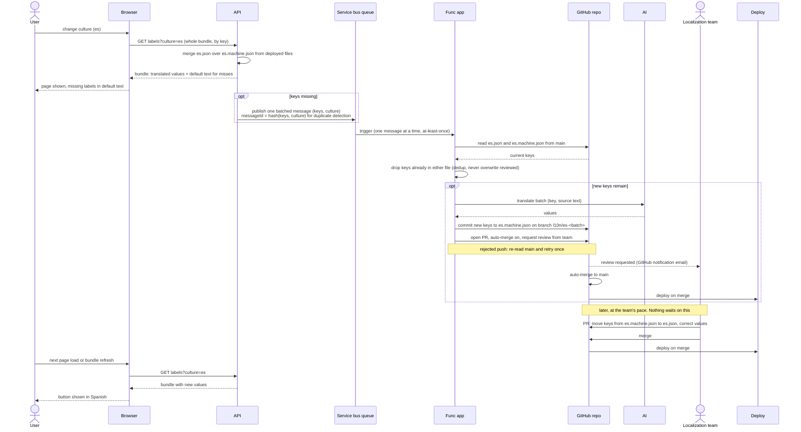

# Label localization sequence, v3: repo bundles and pull requests

Scope: product UI strings only. Tenant-authored content is out of scope.

Translations live as keyed bundle files in the repo, two per culture:

- `es.json`, the reviewed file. Humans edit it. It always wins.
- `es.machine.json`, the AI file. Only the Func app writes to it.

The API serves the merged bundle, reviewed over machine. There is no DB, no
pending table, no sweep, no status column, and no Review UI. The pull request
is the notification, the review tool, the audit log, and the revert button.

Flow:

1. A miss in the merged bundle publishes one batched message per culture.
2. The Func app reads both files from main, drops any key already present in
   either, and asks AI to translate the rest. That file-level check is the
   dedup and the "never overwrite reviewed" guard in one step.
3. It commits the new keys to the machine file and opens a pull request with
   the batch in the description. The PR is set to auto-merge. Reviewers are
   requested on it, which is the email notification for free.
4. Merge triggers the deploy. The AI value is live on the next deploy without
   waiting on anyone.
5. Later, a reviewer opens a normal PR that moves keys from the machine file
   into the reviewed file, correcting them as needed. Merge and deploy.

Rules that keep it safe:

- Queue consumer handles one message at a time, so two invocations never push
  to the same branch at once. A rejected push is retried after a fresh read.
- Message delivery is at least once. A redelivered batch finds its keys already
  in the machine file and does nothing.
- Translation latency is bounded by deploy time. If deploys are slow, this is
  the wrong design.

